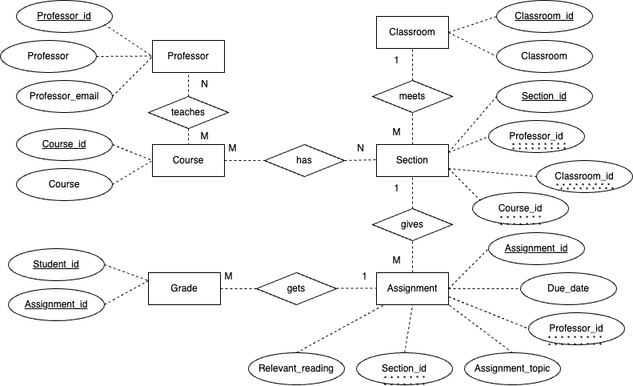

# Data Normalization and Entity-Relationship Diagramming

## The Original Data Set

The following table, representing students' grades in courses at a university, is already in first normal form

| assignment_id | student_id | due_date | professor | assignment_topic                | classroom | grade | relevant_reading    | professor_email   |
| :------------ | :--------- | :------- | :-------- | :------------------------------ | :-------- | :---- | :------------------ | :---------------- |
| 1             | 1          | 23.02.21 | Melvin    | Data normalization              | WWH 101   | 80    | Deumlich Chapter 3  | l.melvin@foo.edu  |
| 2             | 7          | 18.11.21 | Logston   | Single table queries            | 60FA 314  | 25    | Dümmlers Chapter 11 | e.logston@foo.edu |
| 1             | 4          | 23.02.21 | Melvin    | Data normalization              | WWH 101   | 75    | Deumlich Chapter 3  | l.melvin@foo.edu  |
| 5             | 2          | 05.05.21 | Logston   | Python and pandas               | 60FA 314  | 92    | Dümmlers Chapter 14 | e.logston@foo.edu |
| 4             | 2          | 04.07.21 | Nevarez   | Spreadsheet aggregate functions | WWH 201   | 65    | Zehnder Page 87     | i.nevarez@foo.edu |
| ...           | ...        | ...      | ...       | ...                             | ...       | ...   | ...                 | ...               |

> This data set is not compliant with 4NF. Records in the 4NF must satisfy the requirements of 1NF, 2NF, and 3NF firstly. Since the table is already in the the 1NF, I'll start from the requirements of 2NF. 2NF states that a non-key field must provide a fact about the entity uniquely identified by the primary key. If assignment_id and student_id together serve as the composite primary key to guarantee the uniqueness for each record, then each non-key field must provide a fact about both assignment_id and student_id. This requirement is not satisfied. For example, due_date, assignment_topic, and relevant_reading is only associated with assignment_id, while classroom is only associated with student_id. Only grade and professor are facts about both assignment and student. Professor_email is neither a fact about assignment, nor a fact about student. As with the second normal form, the third normal form deals with the relationship between non-key and key fields. It is violated when a non-key field is a fact about another non-key field. For example, professor_email is a fact about professor, which is a non-key field. Under the fourth normal form, a record type should not contain two or more independent multi-valued facts about an entity. It is also violated by this table. For example, one professor can teach different sections at diffrent classrooms and give different assignments and relevant readings to different sections. In order to normalize these records, I chose to split the data into six tables.

## Assumptions

This data represents information about students' grades in courses at a university. The dependencies reflect the reality of how courses work in most universities.

- each course can be taught by multiple professors in different sections
- each professor might teach multiple sections of the same course
- each section meets in a specific classroom with a specific professor
- different sections of the same course may meet in different classrooms, even if the professor is the same
- professors give assignments with due dates that are specific to the section of the course
- professors give readings that are relevant and helpful to a given assignment.
- a professor might (or might not) give the same assignment to different sections of the same course, but with different due dates
- professors give readings to help with the assignments
- students complete assignments and receive a grade

## Requirements

### Convert to 4NF

Convert this table to the fourth normal form

1. One table for professors

| professor_id | professor | professor_email   |
| ------------ | --------- | ----------------- |
| 1            |  Melvin   | l.melvin@foo.edu  |
| 2            |  Logston  | e.logston@foo.edu |
| 3            |  Nevarez  | i.nevarez@foo.edu |
| ...          |  ...      | ...               |

Professor_id is the primary key for professors table , each professor has his/her own name and own email. 

2. One table for courses

| course_id | course                          |
| --------- | ------------------------------- |
| 1         | Database Design                 |
| 2         | Introduction to Computer Science|
| 3         | Introduction to Data Science    |
| ...       | ...                             |

Course_id is the primary key for courses table, each course has its own name.

3. One table for classrooms

| classroom_id | classroom |
| ------------ | --------- |
| 1            | WWH 101   |
| 2            | 60FA 314  |
| 3            | WWH 201   |
| ...          | ...       |

Classroom_id is the primary key for classrooms table, the table stores the specific location information for each classroom.

4. One table for sections

| section_id | professor_id | course_id | classroom_id |
| ---------- | ------------ | --------- | ------------ |
| 1          | 1            | 1         | 1            |
| 2          | 2            | 1         | 2            |
| 3          | 3            | 3         | 3            |
| ...        | ...          | ...       | ...          |

Section_id is the primary key for sections table. Professor_id, course_id, and classroom_id are the foreign keys here, refering to professors table, courses table, and classrooms table respectively. Each course will have different sections and each sections can be taught by different (or the same) professors in different classrooms. 

5. One table for assignments

| assignment_id | due_date | professor_id | assignment_topic                | section_id | relevant_reading    |
| ------------- | -------- | ------------ | ------------------------------- | ---------- | ------------------- |
| 1             | 23.02.21 | 1            | Data normalization              | 1          | Deumlich Chapter 3  |
| 2             | 18.11.21 | 2            | Single table queries            | 2          | Dümmlers Chapter 11 |
| 3             | 23.02.21 | 2            | Python and pandas               | 3          | Dümmlers Chapter 14 |
| ...           | ...      | ...          | ...                             | ...        | ...                 |

Assignment_id is the primary key for the assignments table. Professor_id and section_id are the foreign keys here, refering to the professors table and sections table respectively. Professors give assignments, with due dates that are specific to the section of the course. Different assignment will have different topics and relevant readings. 

6. One table for grades

| student_id | assignment_id | grade |
| ---------- | ------------- | ----- |
| 1          | 1             | 80    |
| 7          | 2             | 25    |
| 4          | 1             | 75    |
| 2          | 5             | 92    |
| 2          | 4             | 65    |
| ...        | ...           | ...   |

Student_id and assignment_id are the composite primary key for grades table. Here, I use a composite primary key to make sure the student-assignment combinations are unique.

> 4NF-compliant

- **1NF**: The original table is already in first normal form
- **2NF**: A non-key field must provide a fact about the entity uniquely identified by the primary key. It is not allowed for a non-key field to provide a fact about only a part of that entity or about some other unrelated entity. 2NF is satisfied automatically for professors, courses, classrooms, sections, and assignments tables because I use surrogate keys for these table. For the grades table, grade is the only non-key field, and is clearly associated with both student_id and assignment_id. Grades were given based on the quality of each assignment written by the students.
- **3NF**: Third normal form is violated when a non-key field is a fact about another non-key field. 3NF is satisfied as I break down the original table into several tables: professors, courses, classrooms, sections, assignments, and grades. Now, each table only contains non-key fields that are facts about their primary keys.
- **4NF**: In order for a record to meet fourth normal form, the data must not contain more than one independent multi-valued fact about an entity. Through splitting the data up into multiple tables: professors, courses, classrooms, sections, assignments, and grades, the problem of two or more independent multi-valued fact about an entity is solved successfully. 

### Draw an Entity-Relationship Diagram

The ER diagram I created of my 4NF-compliant version of the data set

_In my entity relationship diagram, primary key attribute names are underlined. I also put double underlines under the foreign key field._

- One professor can teach multiple courses and one course can be taught by multiple professors as well. 
- One course will have different sections, and different courses might share the same section numbers.
- One section meets at one specific classroom, but one classroom can be used by different sections.
- One section can give multiple assignments throughout the semester, but each assignment can only belong to one section.
- One assignment can have multiple grades for different students, but each grade corresponds to each specific assignment written by one student.

